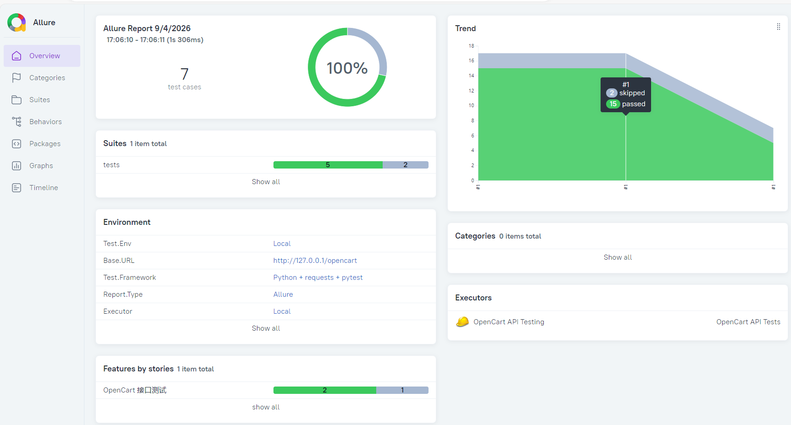

# OpenCart API 接口自动化测试

## 📌 项目简介

基于 Python + requests + pytest + Allure 实现的 OpenCart 电商系统接口自动化测试项目，并集成 JMeter + Locust 双工具性能压测与飞书自动通知能力。

采用 **数据驱动 + API 层封装 + Fixture 依赖注入** 的分层架构，覆盖商品浏览、购物车、结算等核心业务接口。

> **测试环境**：OpenCart 3.0.2.0（本地 XAMPP 部署）  
> **测试地址**：http://127.0.0.1/opencart

---

## 📁 项目结构

```text
opencart_api_test/
├── api/                    # API 业务封装层
│   ├── client.py           # 统一 HTTP 客户端（Session/Cookie/重试/超时/登录）
│   ├── product_api.py      # 商品接口（详情/列表/搜索）
│   └── cart_api.py         # 购物车接口（加购/查看）
├── tests/                  # 测试用例层（只做断言，不直接发请求）
│   ├── test_product.py     # 商品浏览接口测试
│   ├── test_cart.py        # 购物车接口测试
│   └── test_checkout.py    # 结算接口测试（已跳过，由 UI 覆盖）
├── data/                   # 测试数据中心
│   └── test_data.py        # 商品/分类/账号等测试数据
├── jmeter/                 # JMeter 压测脚本（新增）
│   ├── opencart_category_50vu.jmx
│   └── opencart_category_100vu.jmx
├── reports/                # Locust 压测报告（新增）
├── images/                 # 文档截图
├── conftest.py             # Pytest 全局 Fixture（登录态管理）
├── locustfile.py           # Locust 压测脚本（新增）
├── send_feishu_report.py   # 飞书通知推送脚本（新增）
├── pytest.ini              # Pytest 配置文件
├── requirements.txt        # Python 依赖
├── run_tests.bat           # 仅运行接口自动化
├── run_jmeter_auto.bat     # 一键运行 JMeter 压测（新增）
├── run_all.bat             # 全家桶：接口 + Locust + JMeter + 飞书（新增）
└── README.md
```

---

## 🛠️ 技术栈

| 工具/库 | 用途 | 版本 |
|---------|------|------|
| Python | 编程语言 | 3.11+ |
| requests | HTTP 请求库 | 2.31+ |
| pytest | 测试框架 | 7.4+ |
| allure-pytest | 测试报告与用例分级 | 2.16+ |
| pytest-html | HTML 测试报告 | 4.1+ |
| Locust | 性能压测（代码化） | 2.20+ |
| JMeter | 性能压测（梯度加压） | 5.6.3 |

---

## ✨ 设计亮点

### 1. 三层架构，职责分离

```text
测试层(tests) → 业务 API 层(api) → HTTP 客户端层(client)
```

- **client.py**：统一管理 Session、Cookie、请求头、重试策略（5xx 自动重试 3 次），配置 `DEFAULT_TIMEOUT=10` 防止请求挂死
- **product_api.py / cart_api.py**：封装业务接口，支持客户端依赖注入
- **tests/**：只关注业务场景断言，不直接处理 HTTP 细节

### 2. Fixture 管理登录态

`conftest.py` 提供 `api_client` fixture，自动完成登录并返回带 Cookie 的客户端：

```python
@pytest.fixture
def api_client():
    client = APIClient()
    resp = client.login(TEST_USER["email"], TEST_USER["password"])
    # requests 默认跟随 302 重定向，登录结果通过最终 URL 判断
    assert "account/account" in resp.url, "登录失败，请检查 TEST_USER 账号密码"
    return client
```

测试用例通过参数注入直接使用，**消除重复登录代码**；登录失败在 fixture 阶段直接报错，避免产生误导性的用例失败。

> ⚠️ 注意：OpenCart 3 路由使用斜杠分隔（如 `checkout/cart/add`），不支持点分写法（`cart.add` 会被路由过滤器吞掉）。

### 3. 数据与用例分离

所有测试数据集中维护在 `data/test_data.py`：

- 商品信息（ID、名称、价格）
- 分类信息（path、名称）
- 测试账号

修改一处，全局生效，便于维护和多环境切换。

### 4. 环境配置解耦

`BASE_URL` 支持通过环境变量注入，默认本地地址：

```python
BASE_URL = os.getenv("OPENCART_BASE_URL", "http://127.0.0.1/opencart")
```

支持本地开发、CI/CD 流水线、不同测试环境无缝切换。

### 5. Allure 报告分级

采用 `@allure.epic / feature / story` 三级注解，生成结构化的测试报告：

- **epic**：项目级（OpenCart 接口测试）
- **feature**：模块级（商品浏览 / 购物车 / 结算）
- **story**：功能级（商品详情 / 加购 / 搜索）

### 6. 性能压测 + 飞书通知（新增）

- **JMeter**：50/100 并发梯度加压，生成 HTML 报告
- **Locust**：15/25 并发代码化压测，生成 CSV 数据
- **飞书通知**：测试完成后自动解析报告，推送结构化消息到飞书群，包含总请求数、失败率、平均响应时间、P95、吞吐量等关键指标

---

## 📊 测试覆盖

| 模块 | 用例数 | 结果 | 说明 |
|------|--------|------|------|
| 商品浏览 | 3 | ✅ 全部通过 | 详情查询、分类列表、关键词搜索 |
| 购物车 | 2 | ✅ 全部通过 | 正常加购、获取购物车（依赖登录态） |
| 结算 | 2 | ⏭️ 跳过 | 依赖复杂前端会话，由 UI 自动化覆盖 |
| **合计** | **7** | **5 通过 / 2 跳过** | **通过率 100%** |

### 性能压测（参考数据）

| 工具 | 并发数 | 总请求数 | 失败率 | 平均响应时间 | P95 |
|------|--------|---------|--------|-------------|-----|
| JMeter | 50 | 103,620 | 0.00% | 25.03 ms | 110 ms |
| JMeter | 100 | 109,068 | 0.00% | 47.69 ms | 264 ms |
| Locust | 15 | 836 | 0 | 188.24 ms | — |
| Locust | 25 | 1,355 | 0 | 198.46 ms | — |

---

## 🚀 快速开始

### 前置条件

1. 本地部署 OpenCart（XAMPP/WAMP）
2. 启动 Apache + MySQL 服务
3. 确认可访问 http://127.0.0.1/opencart
4. **修改 `data/test_data.py` 中的 `TEST_USER` 为你的真实账号**

### 1. 克隆项目

```bash
git clone https://github.com/StillStream-ink/opencart-api-test.git
cd opencart-api-test
```

### 2. 创建虚拟环境（推荐）

```bash
python -m venv .venv
.venv\Scripts\activate
```

### 3. 安装依赖

```bash
pip install -r requirements.txt
```

### 4. 运行测试

```bash
# 基础运行
pytest tests/ -v

# 生成 HTML 报告
pytest tests/ -v --html=reports/report.html --self-contained-html

# 生成 Allure 报告
pytest tests/ -v --alluredir=./reports/allure-results
allure serve ./reports/allure-results
```

### 5. 一键运行（Windows）

双击 `run_tests.bat` 即可执行全部测试并生成 Allure 报告（含历史趋势）。

### 6. 运行 Locust 压测

```bash
locust -f locustfile.py --host=http://127.0.0.1/opencart --users 15 --spawn-rate 5 --run-time 2m --headless --csv=reports/locust_15user
```
### 7. 运行 JMeter 压测

```bash
jmeter -n -t jmeter/opencart_category_50vu.jmx -l jmeter/result_50vu.jtl -e -o jmeter/report_50vu -f
```
### 8. 一键运行全家桶

双击 run_all.bat，自动顺序执行：接口自动化 → Locust → JMeter → 飞书通知。

---

## 📄 测试报告示例



报告包含用例执行状态、耗时、历史趋势、环境信息等。

---

## 🔧 环境变量配置

| 变量名 | 说明 | 默认值 |
|--------|------|--------|
| `OPENCART_BASE_URL` | OpenCart 服务地址 | `http://127.0.0.1/opencart` |

示例：

```bash
# PowerShell
$env:OPENCART_BASE_URL="http://192.168.1.100:8080/opencart"
pytest tests/ -v
```
---
## 📢 飞书通知配置

1. 在飞书群聊中添加**自定义机器人**，获取 Webhook 地址
2. 修改 `send_feishu_report.py` 中的 `FEISHU_WEBHOOK` 变量
3. 运行 `python send_feishu_report.py` 测试通知是否正常发送
   
---

## 📝 相关链接

- [OpenCart 官网](https://www.opencart.com)
- [pytest 官方文档](https://docs.pytest.org)
- [requests 官方文档](https://docs.python-requests.org)
- [Allure Report](https://allurereport.org)
- [Locust 官方文档](https://locust.io)
- [JMeter 官方文档](https://jmeter.apache.org)

---

## 📄 系列文章

- [接口自动化测试实战（pytest + Allure + 数据驱动）](https://juejin.cn/post/7679507799504142386)
- [UI 自动化测试实战（Playwright + POM + 失败自动截图）](https://juejin.cn/post/7681688916479344686)

---

## 📌 作者

- GitHub: [@StillStream-ink](https://github.com/StillStream-ink)
- 项目地址: [opencart-api-test](https://github.com/StillStream-ink/opencart-api-test)
