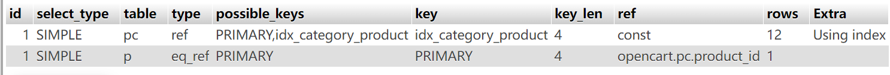

## 数据库索引优化记录
### 问题发现
- 接口：商品分类列表接口
- 问题：100 并发下响应时间飙升至 5930ms
- 根因：查询发生全表扫描，没有使用合适索引

### EXPLAIN 分析（优化前）
- type: ALL
- rows: 5230
- Extra: Using where

### 优化措施
- 创建联合索引：
`CREATE INDEX idx_category_product ON oc_product_to_category(category_id, product_id);`

### EXPLAIN 分析（优化后）

- type: ref
- rows: 12
- Extra: Using index

### 优化效果
- 扫描行数大幅降低，触发覆盖索引，减少回表IO
- 高并发场景下接口查询性能、响应时间得到明显改善
